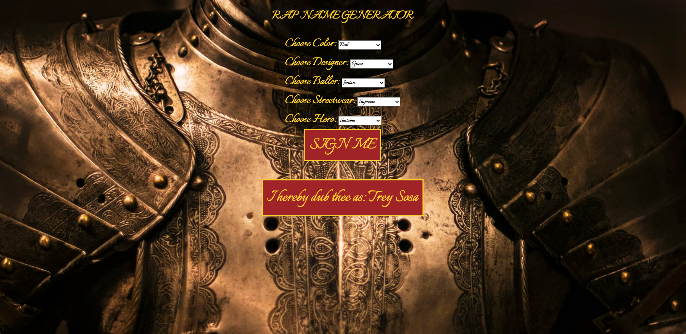

# 🎤 Week08 Bootcamp2019a Project: Wu-Tang Name Generator

### Goal: Create a Wu-Tang Clan name generator. Present the user with 5 survey questions and based on those answers randomly generate their name. The name doesn't have to be exact names, but Wu-Tang sounding-ish names. Ex: Childish Gambino (who actually got his name from a Wu-Tang name generator).

This is my Wu-Tang Name Generator project! Users will complete a short survey that will assign them a "rap" name based on the collection of answers they submit.

</img>

Link to live site: [https://danielmtran-wutang.netlify.app]

### How It's Made:

Tech used: HTML, CSS, JAVASCRIPT

I made the basic styling and layout of the app via HTML and CSS. The main functionality of the app was made using Javascript.

### Optimizations:

Will add more options to the survey and more name combinations!

### Lessons Learned:

