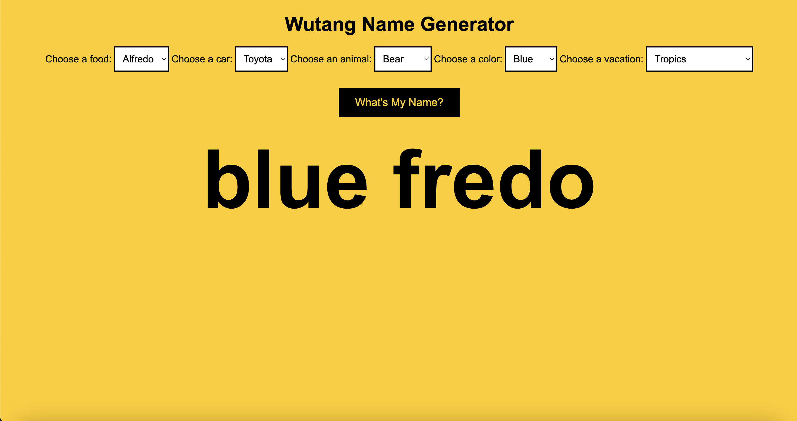

# 🎤 Week08 Bootcamp2019a Project: Wu-Tang Name Generator

### Goal: Create a Wu-Tang Clan name generator. Present the user with 5 survey questions and based on those answers randomly generate their name. The name doesn't have to be exact names, but Wu-Tang sounding-ish names. Ex: Childish Gambino (who actually got his name from a Wu-Tang name generator).

This project has 4 dropdown menus from which the user can select what they like the most. The categories are food, car, animal, color, and vacation. Once the user selects desired options, the user checks to see what their name is and a two worded name generates. The names are funky, fun, and sometimes even funny.

Link to project: https://alejandralondev.github.io/wu-tang-generator/ 

How It's Made:
Tech used: HTML, CSS, JavaScript,
