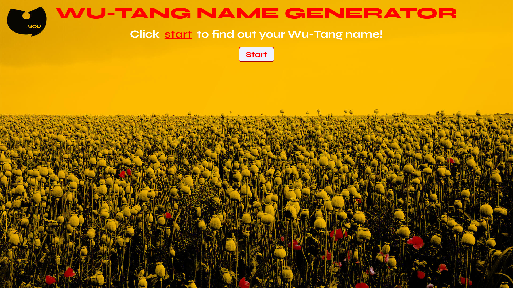

# Wu-Tang Name Generator

Create your own Wu-Tang Clan name by answering five survey questions. The generated name will have that distinctive Wu-Tang vibe, adding a touch of hip-hop flair to your persona.

## Tech Used

- **HTML**
- **CSS**
- **JavaScript (Vanilla JS, OOP)**

## How It's Made

This project was developed using HTML for structure, CSS for styling with a touch of glassmorphism to enhance the visual appeal, and Vanilla JavaScript with an Object-Oriented Programming (OOP) approach.

It incorporates a NYC-themed Buzzfeed-style quiz with questions designed to capture the essence of the user. The question card is styled using glassmorphism, and CSS animations add a dynamic touch when the user hovers over potential answer options.

JavaScript is employed to toggle the visibility of the start button, questions, and the generated Wu-Tang name dynamically. The use of OOP allows for reusable code, making it easy to switch out themes, questions, pictures, and answers for different generators.

## Optimizations

- **Object-Oriented Programming (OOP):** Utilized OOP principles for creating modular and reusable code. This facilitates easy customization for different themes, questions, pictures, and answers.

- **Ternary Operators:** Implemented ternary operators to efficiently determine the Wu-Tang name based on user responses, enhancing code readability and conciseness.

## Getting Started 🚀

To discover your Wu-Tang Clan name, follow these steps:

1. **Clone the repository.**

2. **Open the `index.html` file:**

   Open the `index.html` file in your preferred web browser.

3. **Click any box to start the quiz:**

   Begin the NYC-themed Buzzfeed-style quiz by clicking the "Start" button and answering the five survey questions.

Feel free to contribute, report issues, or provide feedback to enhance the Wu-Tang Name Generator.
