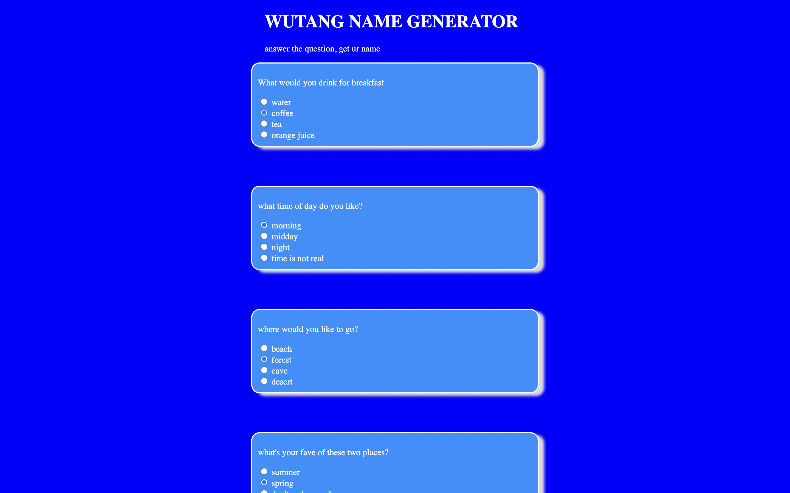

# 🎤 Wutang Generator

### Goal: Create a Wu-Tang Clan name generator. Present the user with 5 survey questions and based on those answers randomly generate their name. The name doesn't have to be exact names, but Wu-Tang sounding-ish names. Ex: Childish Gambino (who actually got his name from a Wu-Tang name generator).

### images

### how it's made
created an array that held the various names
Using a form, I added values to the inputs, and then created a function to create to add the values together. 
then I took the sum of those values, passed it into a function which matches that sum to the necessary array, pulling that text from the index and posting it to the dom. 

### langs used

html, css, javascript

### optimizations

- button that redirects you to the test page
- removing option to chose multiple radios
- background with the css 

- the idea is to make this a little more fully fleshed out app that has a list of personality quizzes to take 
- with an analytic feature, analyzing what, I do not know
### lessons learned

having a plan makes work all the less intense.
