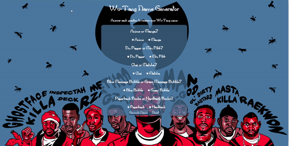

# Wu-Tang Clan Name Generator

Welcome to my Wu-Tang Clan Name Generator project. This fun and creative application presents users with five survey questions and, based on their answers, randomly generates a Wu-Tang Clan-inspired name. The generated names capture the essence of Wu-Tang Clan's unique and iconic style.

[Website](https://roswutanggenerator.netlify.app/)

## How It's Made

Technologies Used: HTML, CSS, JavaScript

In this project, I designed a Wu-Tang Clan Name Generator using HTML, CSS, and JavaScript. The application starts by presenting users with a series of five survey questions. Each input in the survey had a predefined value associated with it, and based on the total value of the selected answers, the JavaScript logic would generate a Wu-Tang Clan-inspired name. I implemented this conditional logic using a `switch case` statement.

The `switch case` statement allowed the application to evaluate the user's responses, calculate the total value, and then select a name that captures the essence of Wu-Tang Clan's unique naming style. The name generated may not be an exact match to the user's answers, but it is designed to have a Wu-Tang Clan vibe.

The project showcases my creativity and ability to engage users in an interactive and entertaining way. It's a fun exercise in using web development to create a unique experience for users.

## Optimizations (optional)

While the primary focus of this project is creativity and user engagement, I also focused on making the application user-friendly and efficient. I optimized the code to ensure a smooth user experience and quick response times. This optimization made the name generation process seamless and enjoyable for users.

## Lessons Learned

Building the Wu-Tang Clan Name Generator was an opportunity to explore creativity within web development. It highlighted the importance of user engagement and enjoyment in applications. The project allowed me to create something fun and entertaining, showing that even as a developer, there's always room for creativity and unique projects.

One notable lesson from this project was that it was my first time using a `switch case` statement in a practical application. Learning to use this control structure to handle multiple conditions and generate different results was a valuable experience. It demonstrated the versatility and power of JavaScript for implementing conditional logic in an engaging way.

No matter the experience level, being an engineer means continuously learning and growing. This project was a reminder of the excitement of building something unique and engaging for users, and I look forward to more creative projects in the future.
