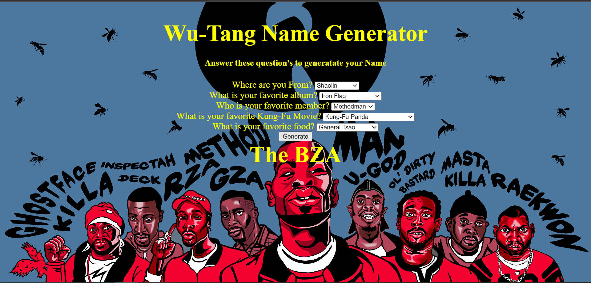

# 🎤 Project: Wu-Tang Name Generator

**Tech used:** HTML, CSS, JavaScript

User is given five questions that determine their Wu-Tang name. I used a select html element to provide a dropdown menu. A number value is created when the user selects an option. Those values recived from the users selection are then added together to receive a total which corresponds to a name.