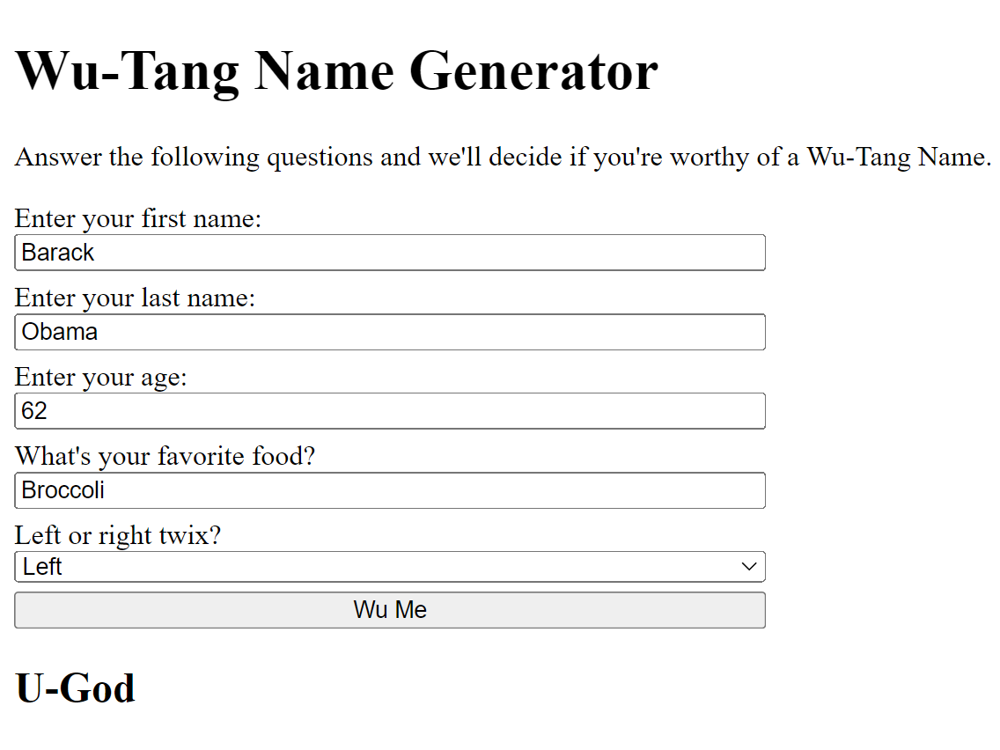

# Wu-Tang Name Generator 🤘🏼🕶️🎵

### Description
Welcome to the Wu-Tang Name Generator, where we determine if you're worthy of a legendary Wu-Tang Name. Answer a few questions, and let the magic unfold.

### How to Use
1. Enter your first name.
2. Enter your last name.
3. Input your age.
4. Share your favorite food.
5. Choose between left or right Twix.
6. Click the "Wu Me" button. Your unique Wu-Tang Name will be revealed!

Check out the generator <a href="https://xsarahyu.github.io/wu-tang-generator-bootcamp/">here</a>!

### Tech Used
- <strong>Node.js</strong>: Powering the server-side functionality.
- <strong>HTML, CSS, JavaScript</strong>: Crafting an interactive and visually appealing front-end.

### Lessons Learned
This project provided invaluable experience in full-stack development, from server-side logic to front-end design.
- <strong>Server-Side Development</strong>
    - <strong>HTTP Server Creation</strong>: Creating a basic HTTP server using Node.js.
    - <strong>URL Paths</strong>: Using the `url` module to parse and handle different URL paths.
    - <strong>Query Parameters</strong>: Utilizing the `querystring` module to parse and extract parameters from the query string.
- <strong>Front-End Design</strong>
    - <strong>Interactive JavaScript</strong>: Implementing interactive features with JavaScript, such as fetching data from the server and updating the UI dynamically.
- <strong>External Libraries</strong>
    - <strong>Figlet</strong>: Integrating the Figlet library for generating ASCII art, adding a creative touch to error messages.
- <strong>Project Organization</strong>
    - <strong>File Structure</strong>: Organizing files into appropriate directories for efficient code management.
    - <strong>Resource Handling</strong>: Managing resources like HTML, CSS, and JS files appropriately.
- <strong>Local Deployment</strong>
    - Setting up and running the application locally for testing and development purposes.