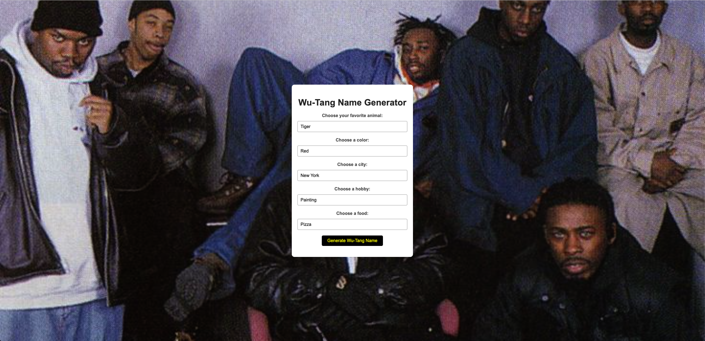

## Wu-Tang Name Generator

This Wu-Tang Name Generator application provides a fun and interactive way for users to generate their own Wu-Tang Clan name based on their preferences.

### Demo:

<p align="center">
  
</p>

### Client-Side JavaScript

The client-side JavaScript is responsible for capturing user input, making a request to the server, and updating the webpage with the generated Wu-Tang name.

```javascript
document.querySelector("#clickMe").addEventListener("click", makeReq);

function makeReq() {
	let q1 = document.getElementById("q1").value;
	let q2 = document.getElementById("q2").value;
	let q3 = document.getElementById("q3").value;
	let q4 = document.getElementById("q4").value;
	let q5 = document.getElementById("q5").value;

	fetch(`/api?q1=${q1}&q2=${q2}&q3=${q3}&q4=${q4}&q5=${q5}`)
		.then((response) => response.json())
		.then((data) => {
			console.log(data);
			document.querySelector("#personName").textContent = data.result;
		});
}
```

This script adds an event listener to a button, gathers the user's answers from dropdown menus, sends a fetch request to the server, and updates the webpage with the result.

### Server-Side JavaScript - Name Generation Function

The server-side JavaScript includes a function named `generator`, which is responsible for generating the Wu-Tang name based on the user's answers to the questions.

```javascript
function generator(q1, q2, q3, q4, q5) {
	const combinations = {
		// ... (all other combinations)
		dragongreennychicagopaintingtaco: "Verdant Dragon",
		tigerbluechicagodancingpizza: "Azure Tiger",
		dragonredchicagoplayingMusicburger: "Crimson Dragon",
		snakebluechicagopaintingtaco: "Sapphire Serpent",
		tigerpurplelosAngelesdancingburger: "Amethyst Tiger",
	};

	const name = combinations[`${q1}${q2}${q3}${q4}${q5}`];
	return name || "Childish Gambino"; // Default name if no match is found
}
```

The `generator` function takes five parameters: `q1`, `q2`, `q3`, `q4`, and `q5`, each corresponding to the user's answers to the five questions in the form.

Inside the function, there is an object named `combinations` that holds a series of key-value pairs. Each key is a string concatenating the possible answers for the five questions, and each value is the corresponding Wu-Tang name. For example, the key `"dragongreennychicagopaintingtaco"` corresponds to choosing "Dragon" for the favorite animal, "Green" for the color, "NYC" for the city, "Painting" for the hobby, and "Taco" for the food, resulting in the Wu-Tang name "Verdant Dragon".

The function then attempts to find a Wu-Tang name based on the user's answers by concatenating the parameters and using the resulting string to look up a value in the `combinations` object. If a match is found, the corresponding Wu-Tang name is returned. If no match is found, the default name "Childish Gambino" is returned.

This approach ensures that the application can generate a unique Wu-Tang name for a wide variety of answer combinations, providing a fun and personalized experience for the user.

The server-side JavaScript handles the request, generates the Wu-Tang name based on the answers provided, and sends the result back to the client.

```javascript

else if (page == "/api") {
	if (
		"q1" in params &&
		"q2" in params &&
		"q3" in params &&
		"q4" in params &&
		"q5" in params
	) {
		res.writeHead(200, { "Content-Type": "application/json" });
		let wuTangNameGen = generator(
			params.q1,
			params.q2,
			params.q3,
			params.q4,
			params.q5
		);
		const objToJson = {
			result: wuTangNameGen,
		};
		res.end(JSON.stringify(objToJson));
	} else {
		res.writeHead(200, { "Content-Type": "application/json" });
		const objToJson = {
			name: "Please Answer all the questions",
		};
		res.end(JSON.stringify(objToJson));
	}
}
```

This script includes a function to generate a Wu-Tang name based on specific combinations of answers and the server endpoint to handle the generation request.

### HTML Form

The HTML form provides a user-friendly interface for inputting preferences to generate a Wu-Tang name.

```html
<div class="select-group">
	<label for="q1">Choose your favorite animal:</label>
	<select id="q1">
		<option value="tiger">Tiger</option>
		<option value="dragon">Dragon</option>
		<option value="snake">Snake</option>
	</select>
</div>

<!-- Repeat for other questions -->

<div class="select-group">
	<label for="q5">Choose a food:</label>
	<select id="q5">
		<option value="pizza">Pizza</option>
		<option value="burger">Burger</option>
		<option value="taco">Taco</option>
	</select>
</div>
```

Each dropdown menu corresponds to a different question, allowing users to select their preferences.

## Conclusion

Developing the Wu-Tang Name Generator was a fantastic learning experience in integrating client-side interactions with server-side logic. It showcased the power of JavaScript both in the browser and on the server, creating a fun and interactive application.
