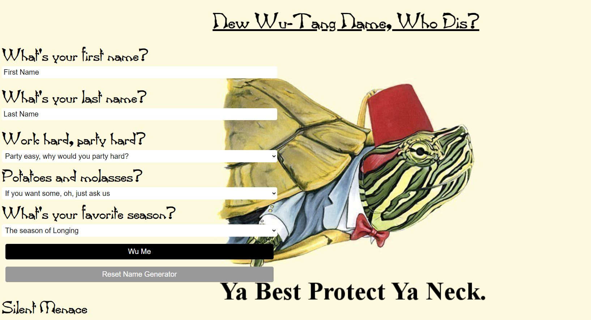

# Wu-Tang Name Generator

A Wu-Tang Clan name generator. The user has 5 survey questions and, based on their answers, a Wu-Tang name is generated for them.

Link to project: https://menahassan-wutang-name-generator.netlify.app/

# How It's Made
Tech used: HTML, CSS, JavaScript

# Lessons Learned:
This project allowed me to use JavaScript to manipulate HTML elements and generate random names based on user input. I had fun with creating the arrays in JavaScript and the dropdown options in HTML.

