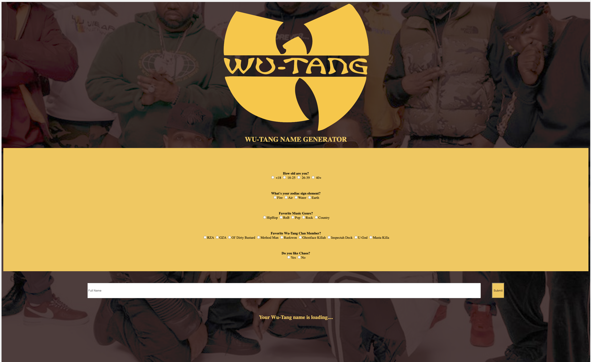

# 🎤 Week08 Bootcamp2019a Project: Wu-Tang Name Generator

# Description: 

Created a Wu-Tang Clan name generator. User answers 5 survey questions and based on those answers the application randomly generates their name.

# Tech Used:

 HTML, CSS, JS, API, JSON, NODE.JS
